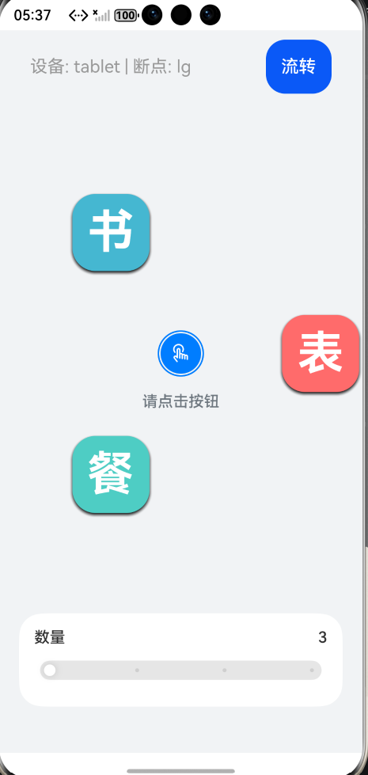
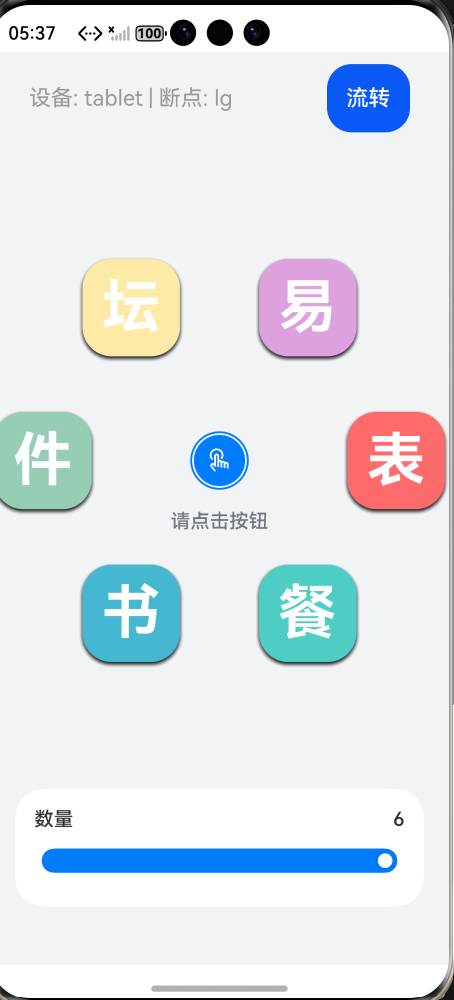
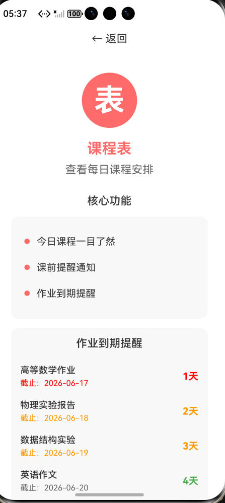

# 校园生活助手 - 基于HarmonyOS动画的校园服务应用

### 项目简介

本项目是基于HarmonyOS显式动画和属性动画能力开发的**大学生校园生活助手应用**。在原有动画演示项目的基础上，创新性地融入了贴近大学生日常学习生活的实用功能，打造了一款集课程管理、校园服务、生活便利于一体的综合性校园服务软件。

### 核心特色

本项目在保留原有动画交互体验的基础上，新增了以下大学生日常学习生活相关功能：

- **🎬 流畅动画交互**：基于animateTo显式动画和属性动画，实现图标旋转展开、缩放、透明度变化等流畅动效
- **📚 课程表管理**：查看每日课程安排、课前提醒通知、作业到期三色提醒系统
- **🍽️ 校园食堂查询**：实时查看各食堂菜单、菜品价格、排队情况
- **📖 图书馆服务**：座位预约查询、按教室和时间搜索空闲座位、图书检索预约
- **📦 快递查询**：快递到件通知、取件码查询、快递点位置导航
- **💬 校园论坛**：校园热点话题、失物招领信息、社团活动宣传
- **🛒 二手市场**：闲置物品交易、分类浏览搜索、在线沟通交易
- **📱 一次开发多端部署**：自动适配手机、平板、电视、手表等设备
- **🔄 自由流转**：支持在多设备间无缝迁移应用状态
- **🎨 文字图标设计**：使用文字替代图片资源，完美适配多端显示

### 界面展示

#### **1. 图标展开状态**



**界面说明：**
- 顶部显示设备信息（tablet | lg断点）和流转按钮
- 中心圆形按钮引导用户点击交互
- 底部滑块可调节图标数量（3-6个）
- 简洁的浅灰色背景设计

---

#### **2. 主界面初始状态**



**界面说明：**
- 点击中心按钮后，6个功能图标环形展开
- 每个图标使用独特的文字和颜色标识：
  - 📋 **表** - 课程表（红色）
  - 🍜 **餐** - 校园食堂（青色）
  - 📚 **书** - 图书馆（蓝色）
  - 📦 **件** - 快递查询（绿色）
  - 💬 **坛** - 校园论坛（黄色）
  - 🛒 **易** - 二手市场（紫色）
- 图标具有阴影效果，视觉层次分明

---

#### **3. 功能模块示例**



**界面说明：**
- 以**课程表**功能为例展示功能模块详情页
- **核心功能展示**：今日课程一目了然、课前提醒通知、作业到期提醒
- **作业到期提醒**：三色标注系统
  - 🔴 **红色**：≤1天（紧急）
  - 🟠 **橙色**：2-3天（警告）
  - 🟢 **绿色**：>3天（正常）
- **今日课程安排**：显示时间、课程名称、上课地点
- 底部温馨提示和操作按钮
- 其他5个功能模块（食堂、图书馆、快递、论坛、市场）采用相同的设计风格

---

### 使用流程

1. **启动应用** → 显示主界面和中心动画按钮
2. **点击中心按钮** → 6个功能图标旋转展开（动画效果）
3. **点击功能图标** → 直接进入对应功能详情页
   - 📋 **表** - 课程表：查看今日课程、作业到期提醒
   - 🍜 **餐** - 校园食堂：查看今日菜单、菜品价格
   - 📚 **书** - 图书馆：查询座位空闲状态、预约座位
   - 📦 **件** - 快递查询：查看待取快递、取件码
   - 💬 **坛** - 校园论坛：浏览热门帖子、失物招领
   - 🛒 **易** - 二手市场：浏览二手商品、发布闲置
4. **查看详细信息** → 根据功能查看具体数据
5. **点击返回** → 回到主界面
6. **点击中心按钮** → 图标旋转收回

**多端适配效果：**

| 设备 | 图标大小 | 字体大小 | 布局方向 | 断点类型 |
|------|---------|---------|---------|---------|
| 手机 | 58px | 35px | 竖屏 | sm |
| 平板 | 80px | 48px | 竖屏 | lg |
| 电视 | 96px | 58px | 横屏 | lg |
| 手表 | 32px | 19px | 竖屏 | sm |

### 工程结构
```

├──entry/src/main/ets                // 代码区
│  ├──common
│  │  └──constants
│  │     └──Const.ets                // 常量类
│  ├──entryability
│  │  └──EntryAbility.ets            // 程序入口类，支持流转回调
│  ├──pages
│  │  └──Index.ets                   // 动效页面入口，支持多端适配
│  ├──view
│  │  ├──AnimationWidgets.ets        // 动画组件
│  │  ├──CountController.ets         // 图标数量控制组件
│  │  ├──IconAnimation.ets           // 图标属性动画组件
│  │  └──FeaturePage.ets             // 功能页面组件（校园生活）
│  └──viewmodel
│     ├──IconItem.ets                // 图标类
│     ├──Point.ets                   // 图标坐标类
│     ├──IconsModel.ets              // 图标数据模型
│     ├──DeviceAdapter.ets           // 设备适配管理类
│     └──DistributedManager.ets      // 自由流转管理类
└──entry/src/main/resources          // 资源文件
   └──base/profile
      └──breakpoint_type.json5       // 断点配置文件
```

### 相关概念

- 显式动画：提供全局animateTo显式动画接口来指定由于闭包代码导致的状态变化插入过渡动效。

- 属性动画：组件的某些通用属性变化时，可以通过属性动画实现渐变过渡效果，提升用户体验。支持的属性包括width、height、backgroundColor、opacity、scale、rotate、translate等。

- Slider：滑动条组件，通常用于快速调节设置值，如音量调节、亮度调节等应用场景。

- **一次开发，多端部署**：通过DeviceAdapter自动检测设备类型和屏幕尺寸，实现一套代码适配多种设备。

- **自由流转**：应用可以在多个HarmonyOS设备间无缝迁移，保持应用状态连续性。

### 使用说明

1. 进入首页点击按钮会有相应数量的图标由中心旋转而出，再次点击突变会由四周旋转缩回原点。
2. 滑动下方滑动条控制动画图标数量，最少显示3个动画图标，最多6个。
3. 点击单个图标会有旋转、透明度变化的动画效果。
4. 再次点击展开的图标可进入对应功能页面：
   - **课程表**：查看每日课程安排，上课提醒
   - **校园食堂**：查看菜单、价格、排队情况
   - **图书馆**：座位预约、图书查询、借阅记录
   - **快递查询**：快递到件通知、取件码查询
   - **校园论坛**：校园动态、失物招领、话题讨论
   - **二手市场**：闲置物品交易、二手买卖
5. 点击右上角"流转"按钮可查看可用设备列表（需要真实设备支持）。
6. 应用会自动适配不同设备类型：
   - **手机**：垂直布局，标准尺寸
   - **平板**：垂直布局，大尺寸
   - **电视**：水平布局，超大尺寸
   - **手表**：紧凑布局，小尺寸

### 多端适配特性

**断点系统**：
- **sm (小屏)**：宽度 < 600vp，适用于手机竖屏、手表
- **md (中屏)**：600vp ≤ 宽度 < 840vp，适用于手机横屏、小平板
- **lg (大屏)**：宽度 ≥ 840vp，适用于平板、电视

**自适应能力**：
- 图标尺寸根据设备类型自动调整
- 布局方向根据屏幕比例自动切换（横屏/竖屏）
- 字体大小根据断点自动缩放
- 间距和边距根据屏幕尺寸自动调整

### 约束与限制

1. 本示例支持标准系统上运行，支持设备：华为手机、平板、电视、手表。
2. HarmonyOS系统：HarmonyOS 5.0.5 Release及以上。
3. DevEco Studio版本：DevEco Studio 6.0.2 Release及以上。
4. HarmonyOS SDK版本：HarmonyOS 6.0.2 Release SDK及以上。
5. 自由流转功能需要真实设备支持，模拟器无法测试流转能力。
6. 校园生活功能为演示界面，实际功能需要接入校园服务API。

### 校园生活功能详解

本应用精心设计了6个贴近大学生日常学习生活的功能模块，每个模块都提供了实用的查询和管理功能：

#### **1. 📚 课程表管理**
- **今日课程一目了然**：清晰展示每日课程时间、名称、地点
- **课前提醒通知**：避免错过重要课程
- **作业到期提醒**：三色标注系统
  - 🔴 红色：≤1天（紧急）
  - 🟠 橙色：2-3天（警告）
  - 🟢 绿色：>3天（正常）

#### **2. 🍽️ 校园食堂**
- **实时更新每日菜单**：查看各食堂今日菜品
- **显示菜品价格**：帮助学生合理规划餐饮消费
- **排队情况查询**：合理安排就餐时间

#### **3. 📖 图书馆服务**
- **座位查询预约**：按教室名称和时间段搜索空闲座位
- **实时座位状态**：显示可用/总数，标注空闲/紧张状态
- **图书检索预约**：快速查找所需图书
- **借阅记录管理**：查看借阅历史和到期提醒

#### **4. 📦 快递查询**
- **快递到件通知**：实时接收快递到达提醒
- **取件码查询**：快速获取取件码信息
- **快递点位置**：显示快递点位置信息

#### **5. 💬 校园论坛**
- **校园热点话题**：了解校园最新动态
- **失物招领信息**：发布和查找丢失物品
- **社团活动宣传**：查看校园活动信息

#### **6. 🛒 二手市场**
- **闲置物品交易**：发布和浏览二手商品
- **分类浏览搜索**：快速找到所需物品
- **在线沟通交易**：安全便捷的交易平台

